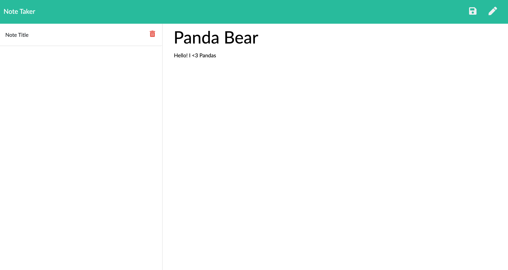
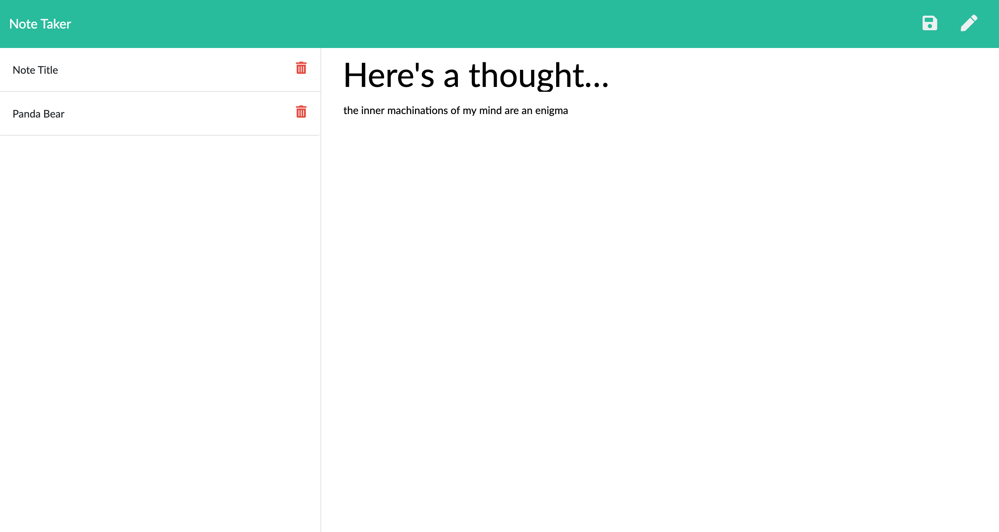
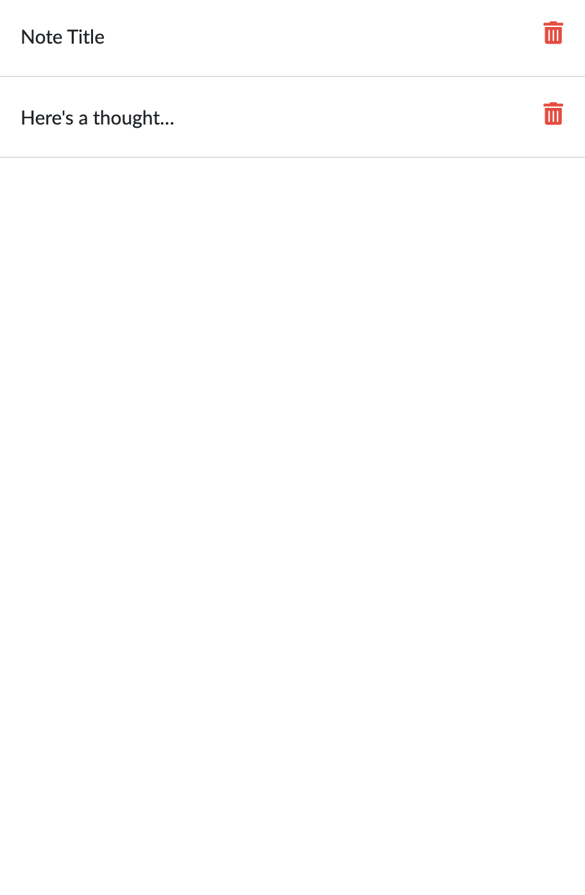
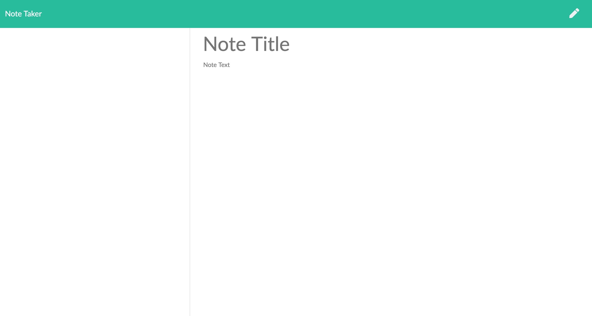

# Express Note Taker

## Description

This Express Note Taker allows users to write, save, and delete notes! Write whatever is on your mind in the note field, add a title, then save it for later by pressing on the floppy disk icon in the top right corner. You can access your note later by clicking on the corresponding title on the left. When you're ready to part with your note click on the garbage can icon and its gone!

### Table of Contents

[Installation](#installation)
[Usage](#usage)
[License](#license)
[Questions](#questions)

### Installation

User must have express installed in order to run the Express Note Taker app. From there the user can run he app.js through a CLI and follow the local host link.

### Usage

In order to start the application the user must have express installed. Once express is installed, open the app.js file in the CLI and follow the localhost link! 

### License

### Questions

### cjpalmerin@gmail.com

