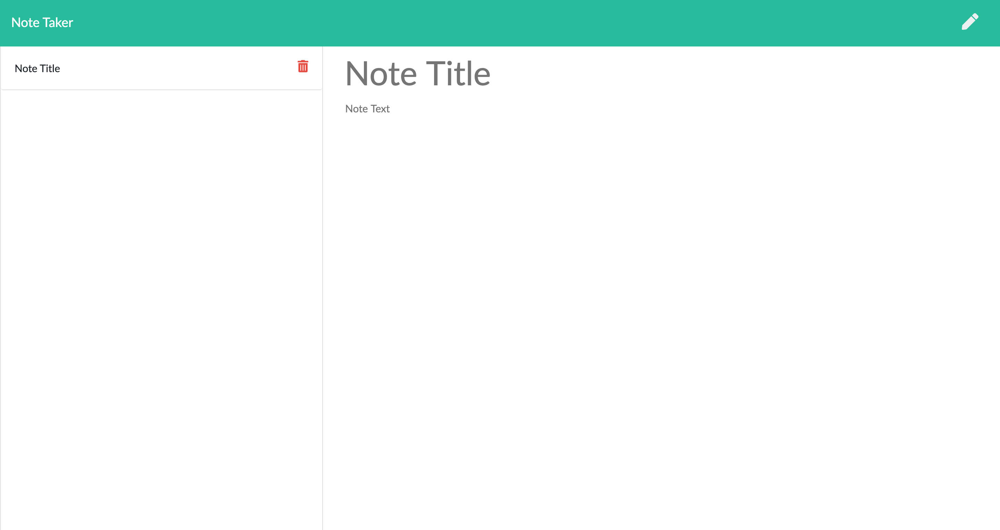

# Express Note Taker

Check out Express Note Taker Here: https://express-note-taker-cjpalmerin.herokuapp.com/

## Description

This Express Note Taker allows users to write, save, and delete notes! Write whatever is on your mind in the note field, add a title, then save it for later by pressing on the floppy disk icon in the top right corner. You can access your note later by clicking on the corresponding title on the left. When you're ready to part with your note click on the garbage can icon and its gone!

### Table of Contents

[Installation](#installation) | 
[Usage](#usage) | 
[License](#license) | 
[Questions](#questions) | 

### Installation

Not installation necessary! Click on the link above or in the Usage section and you're good to go.

### Usage

Check out Express Note Taker Here: https://express-note-taker-cjpalmerin.herokuapp.com/

### License

### Questions

### cjpalmerin@gmail.com

